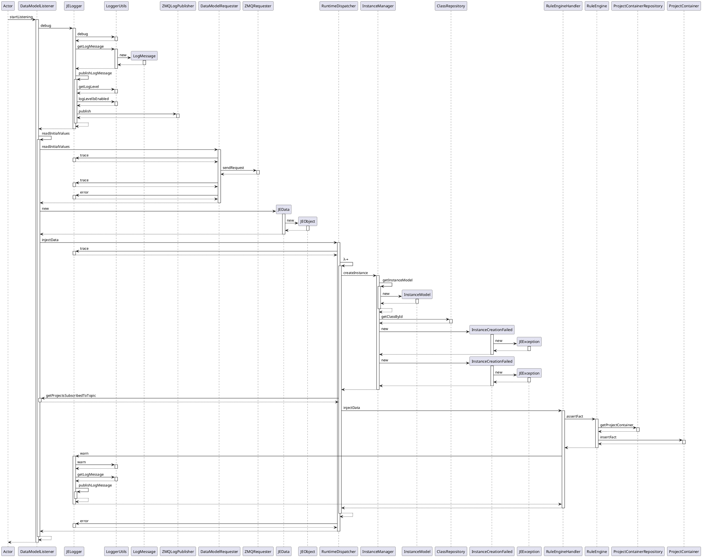
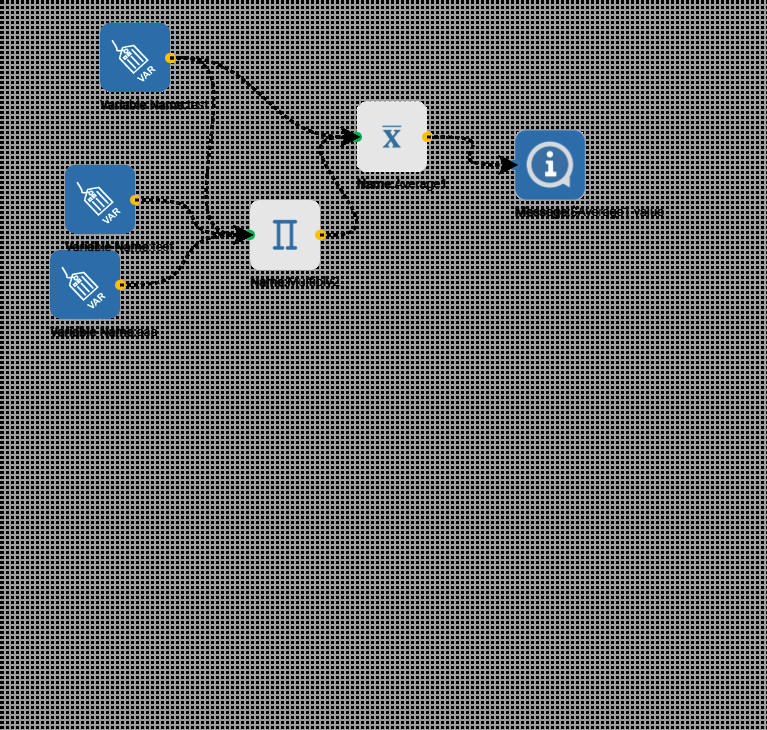

## Adding Blocks

### ⚠ Always run editor as admin

### 1. Add Workflow Block

1. Add block implementation inherited from
   class [WorkflowBlock](JEBuilder/WorkflowBuilder/src/main/java/blocks/WorkflowBlock.java)
   in [Blocks](JEBuilder/WorkflowBuilder/src/main/java/blocks) in JEBuilder/WorkflowBuilder
2. Add method to add block in workflow service from front config to Block mapping in
   builder [Workflow service](JEBuilder/ProjectBuilder/src/main/java/io/je/project/services/WorkflowService.java)
3. Add conversion of the block to BPMN using
   the [Model Builder](JEBuilder/WorkflowBuilder/src/main/java/builder/ModelBuilder.java)
4. Add equivalent service task of the block in [Service Tasks](JERunner/WorkflowEngine/src/main/java/io/je/serviceTasks)
5. Add process flow element of the block
   to [Workflow => BPMN builder](JEBuilder/WorkflowBuilder/src/main/java/builder/JEToBpmnMapper.java)

### 2. Add Rule Block

1. Create a class in the rule builder for the
   block [Blocks](JEBuilder/rulebuilder/src/main/java/io/je/rulebuilder/components/blocks) overriding the getExpression
   method and the getAsOperandExpression method ( not always , depending on the block in
   question ) [Get Expression Location](JEBuilder/rulebuilder/src/main/java/io/je/rulebuilder/components/blocks/Block.java)
2. Add attribute mapping of the new block if any to
   the [Attribute Mapping Folder](JEBuilder/rulebuilder/src/main/java/io/je/rulebuilder/config/AttributesMapping.java)
3. In case of a mathematical block we can the function to [Utilities](Utilities/src/main/java/utils/maths)
4. Add block to [Block factory](JEBuilder/rulebuilder/src/main/java/io/je/rulebuilder/components/BlockFactory.java)

# RoadMap

- [ ] 
- [ ] Improve development environment (independent from SIOTH installation)
- [ ] Check Identity Vs Equality in drools( Review Project Container code / remove facts hashMap ?)
- [ ] Refactor blocks attribute mapping
- [ ] Unify the convention in Rules/ Workflows (build/status/deleting DRL/BPMN files...)
- [ ] Integrate Lombok in the code
- [ ] Optimize collections used (HashMap with another data structure)
- [ ] Refactor Hard coded magic strings, log messages and operation IDs (rules)
- [ ] Integrate a Mapper for DTOs for better readability
- [ ] Check TODO list
- [ ] Optimize exception handling
- [ ] Apply rest API best practices in all the endpoints
- [ ] Change all attributes sent to use the JAVA convention (camel case)
- [ ] Add more messages when compiling rules
- [ ] Refactor blocks attribute mapping
- [ ] Unify the convention in Rules/ Workflows (build/status/deleting DRL/BPMN files...)
- [ ] Integrate Lombok in the code
- [ ] Optimize collections used (HashMap with another data structure)
- [ ] Refactor Hard coded magic strings, log messages and operation IDs (rules)
- [ ] Integrate a Mapper for DTOs for better readability

### Questions

-

if the injected data is of type JEObject how does drools get the type of the class to be evaluated??
why would u load only classes used if the user is gonna need them when writing script task
class loading twice issue
class loader
ZMQ not working constantly
nested inheritance produces duplication of the class
class1 => class2 > class1 boucle infinie
why no await for process execution
script task buggy
class loader

